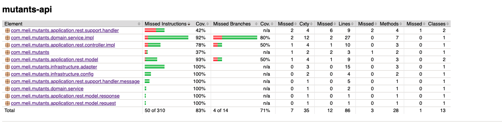
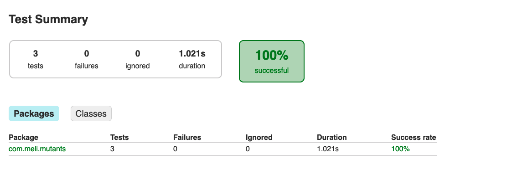
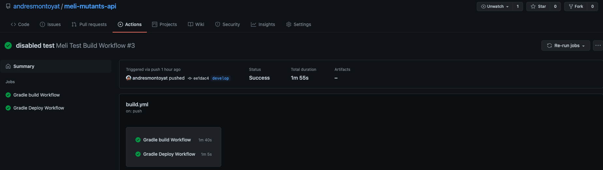

## About The Project

Test for mercadolibre.

### Built With

This section should list any major frameworks that you built your project using. Leave any add-ons/plugins for the acknowledgements section. Here are a few examples.
* [Java](https://java.com)
* [Sprign Framework](https://spring.io)

### Coverage


### Test



### Continuous Integration and deployemnt

We use "Github Actions" for basic continuous integration. We use a build pipeline for building packages and
and for the deployment we use docker with automatic deployment of an instance in AWS ElasticBeanstalk


- [Repository Actions](https://github.com/andresmontoyat/meli-mutants-api/actions)
- [Github Packages](https://docs.github.com/en/packages)
- [Github Actions](https://docs.github.com/en/actions)



## Getting Started

### Prerequisites

Remember to have java and gradle installed.

### Installation

1. Fork this repo https://github.com/andresmontoyat/meli-mutants-api.git

2. Clone the repo
   ```sh
   git clone https://github.com/andresmontoyat/meli-mutants-api.git
   ```
3. Build repo 
   ```sh
   gradle build
   ```
4. or import repo a your favorite IDE


## Usage

To test the service you can make use of postman `postman.json` files in the root of the project.

AWS Beanstalk URL [Link](meli-test-prod-env.us-east-1.elasticbeanstalk.com)

_For more information, please refer to the [Swagger Documentation](http://meli-test-prod-env.us-east-1.elasticbeanstalk.com/swagger-ui.html)_

## Contributing

Contributions are what make the open source community such an amazing place to be learn, inspire, and create. Any contributions you make are **greatly appreciated**.

1. Fork the Project
2. Create your Feature Branch (`git checkout -b feature/AmazingFeature`)
3. Commit your Changes (`git commit -m 'Add some AmazingFeature'`)
4. Push to the Branch (`git push origin feature/AmazingFeature`)
5. Open a Pull Request

## License

See `LICENSE.md` for more information.

## Contact

Andres Montoya - [@github](https://github.com/andresmontoyat) - andresmontoyat@gmail.com

Project Link: [https://github.com/andresmontoyat/meli-mutants-api](https://github.com/andresmontoyat/meli-mutants-api)
